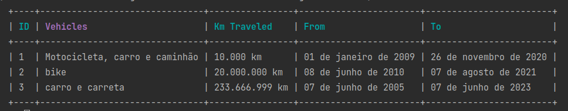

  <a href="#-projeto">Projeto</a>&nbsp;&nbsp;&nbsp;|&nbsp;&nbsp;&nbsp; 
  <a href="#-como-rodar">Como rodar</a>&nbsp;&nbsp;&nbsp;|&nbsp;&nbsp;&nbsp;
  <a href="#-como-contribuir">Como contribuir</a>&nbsp;&nbsp;&nbsp;
  

 

# JSExpert: Modulo IV - Internacionalização

Esse projeto foi desenvolvido com as seguintes tecnologias:

- [JavaScript](https://developer.mozilla.org/pt-BR/docs/Web/JavaScript)
- [Yarn](https://yarnpkg.com/)
- [Npm](https://www.npmjs.com/) 
- [NodeJS](https://nodejs.org/en/) - v19.7.0

## 💻 Projeto

Projeto para treinar fundamentos do ciclo de vida do Javascript. Esse projeto é executado no terminal e podemos adicionar dados sobre o time de meio de transporte usado, a quilometragem e dadas de inicio e termino da jornada. 

Mudando apenas a constante DEFAULT_LANG no index podemos obter os dados com formações diferentes de acordo com o idioma. `:q` fecha o sistema.

Exemplo: 

const DEFAULT_LANG = "pt-BR";

const DEFAULT_LANG = "es";

const DEFAULT_LANG = "en";

const DEFAULT_LANG = "rus"; 

Testes:

## 🚀 Como Rodar

- Clone o projeto.
- Entre na raiz do projeto.
- Execute `npm install`.
- Execute `npm run dev`
- Execute `npm run test` ou `npm run test:cov` para rodar o test

## 🤔 Como contribuir

- Faça um fork desse repositório;
- Cria uma branch com a sua feature: `git checkout -b minha-feature`;
- Faça commit das suas alterações: `git commit -m 'feat: Minha nova feature'`;
- Faça push para a sua branch: `git push origin minha-feature`.

Depois que o merge da sua pull request for feito, você pode deletar a sua branch.

## 📝 Licença

Esse projeto está sob a licença MIT.